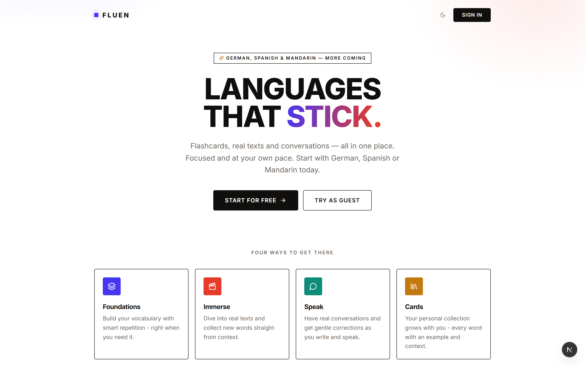
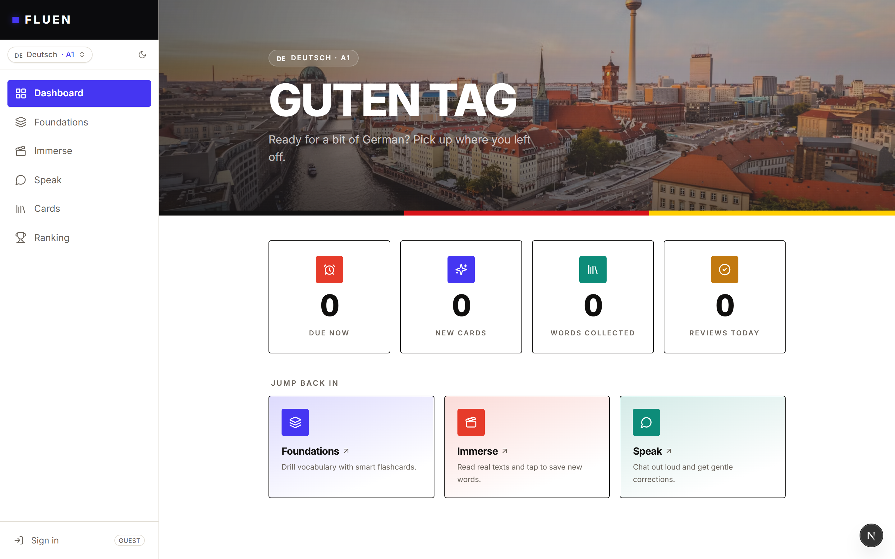
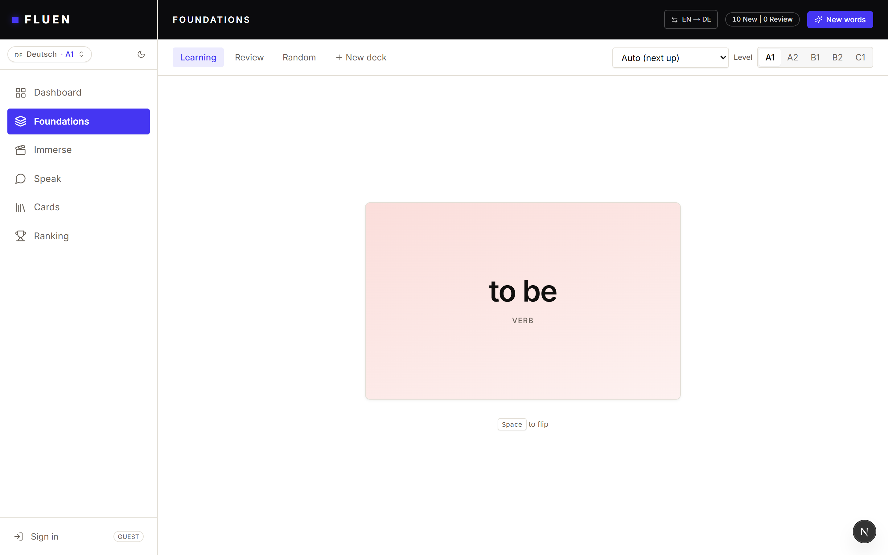
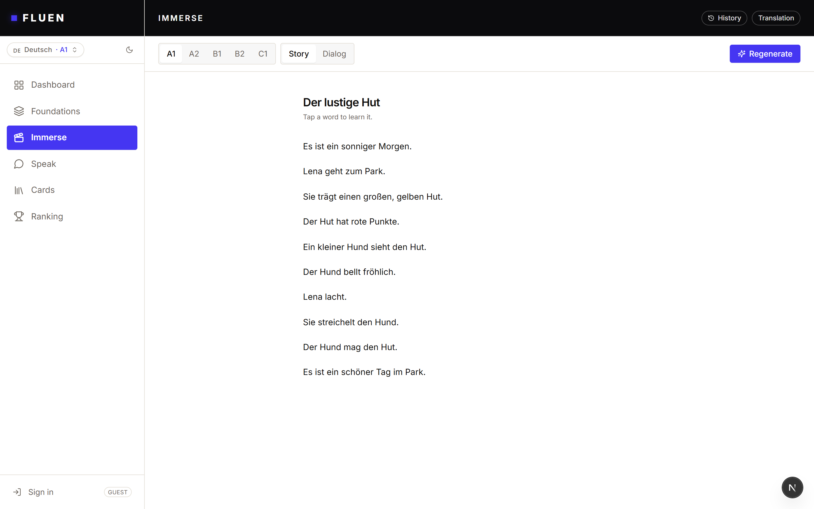
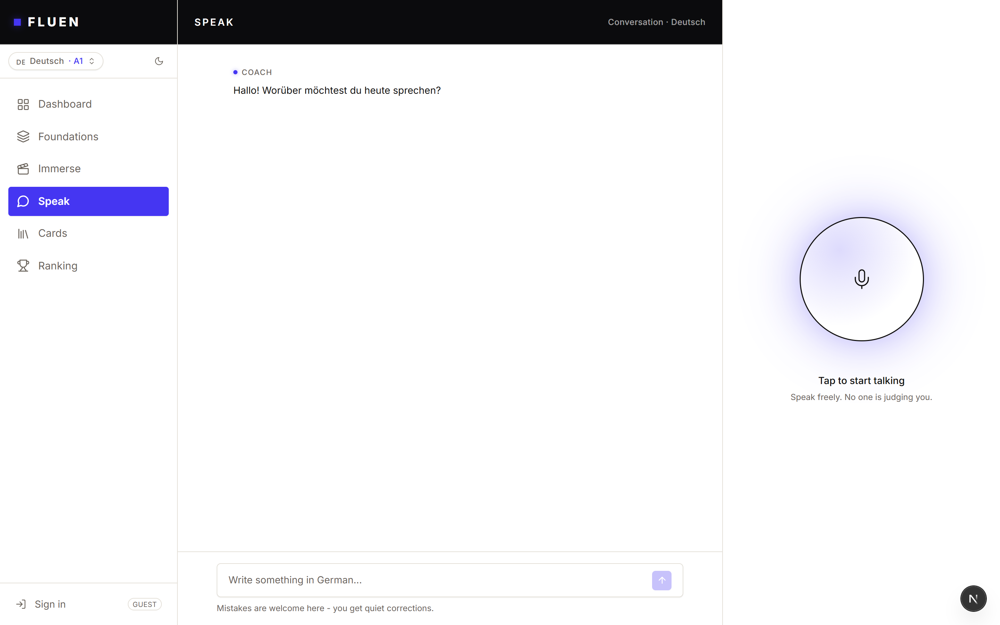

# FLUEN



<!-- [](https://your-live-website.com) -->

Minimalist language learning for self-directed learners. Three methodologies — spaced-repetition vocabulary, comprehensible input, and low-stakes AI conversation — unified in one calm dashboard, with no streaks, leaderboards, or confetti.

---

## 📸 Screens

| Dashboard | Foundations |
|---|---|
|  |  |
| **Immerse** | **Speak** |
|  |  |

---

## 🚀 Features

*   **Three learning modes:** **Foundations** (FSRS spaced repetition for vocabulary), **Immerse** (comprehensible input with click-to-SRS subtitles), and **Speak** (low-stakes AI conversation with ambient grammar corrections).
*   **Works with zero setup:** All modes run on AI generation alone — streaming chat, AI-generated flashcards, and AI-generated stories/dialogs — without requiring a database.
*   **Voice mode:** Browser speech recognition for spoken practice in the Speak tab.
*   **Light & dark themes:** Sun/moon toggle in the sidebar, persisted in localStorage.
*   **Responsive design:** Optimized for mobile, tablet, and desktop.

---

## 🛠️ Tech Stack

*   **Frontend:** Next.js 15, React 19, Tailwind CSS 4, TypeScript, lucide-react
*   **AI:** Google Gemini (`@google/genai`) — `gemini-2.5-flash` for generation, `gemini-3.1-flash-lite` for corrections/definitions
*   **Spaced repetition:** ts-fsrs (FSRS algorithm)
*   **Backend / Database:** Supabase (Postgres with row-level security)

---

## ⚙️ Local Development

Follow these steps to get a local development server running on your machine.

### Prerequisites

Make sure you have Node.js installed.
```bash
node -v
npm -v
```

### Setup

```bash
# 1. Install dependencies
npm install

# 2. Add a Gemini API key (free key: https://aistudio.google.com)
echo GEMINI_API_KEY=... > .env.local

# 3. Start the dev server
npm run dev
```

All learning modes work without a database. Free-tier Gemini quotas are per-model
per day, so splitting calls across two models (configured in `lib/ai.ts`) doubles
the budget.

### Scripts

```bash
npm run dev     # Start the development server
npm run build   # Build for production
npm run start   # Run the production build
npm run lint    # Lint the codebase
```

---

## 📚 Docs

*   [`docs/ARCHITECTURE.md`](docs/ARCHITECTURE.md) — stack, user flows, component architecture, latency budget
*   [`db/schema.sql`](db/schema.sql) — Supabase/Postgres schema with RLS
